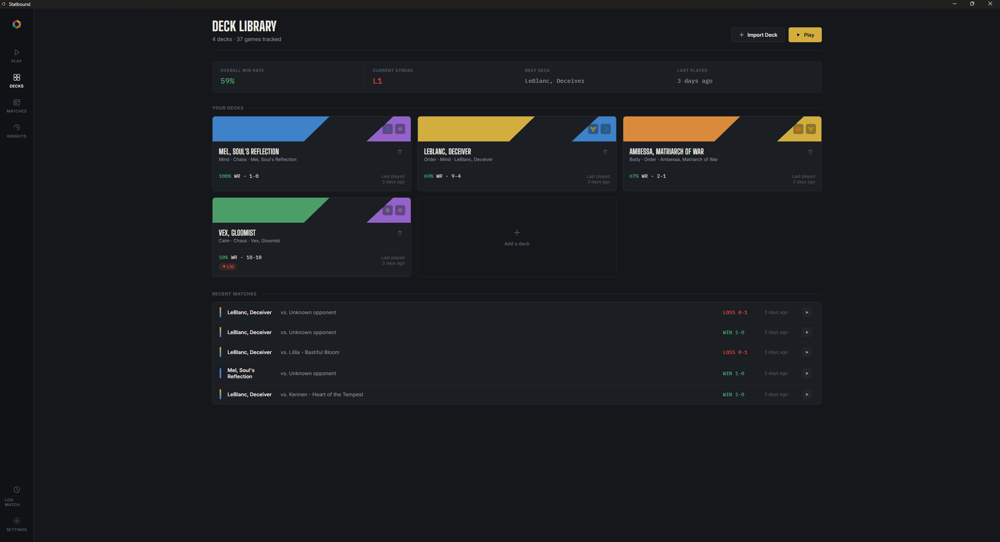
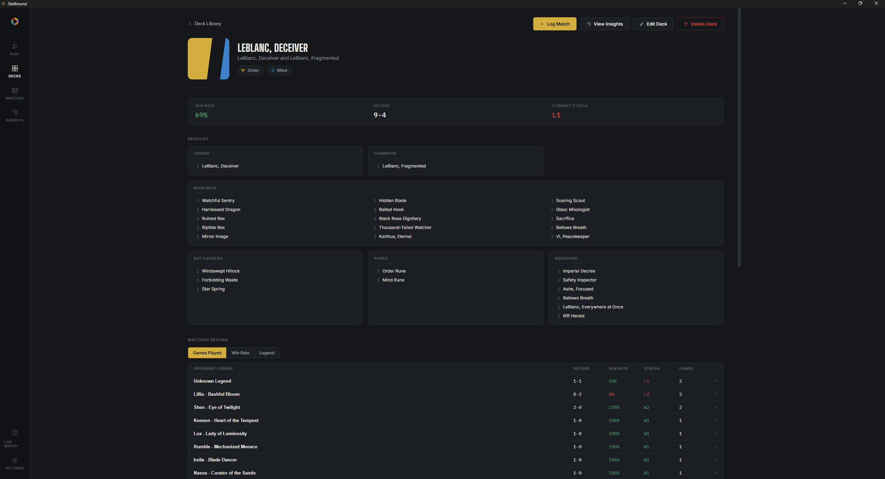
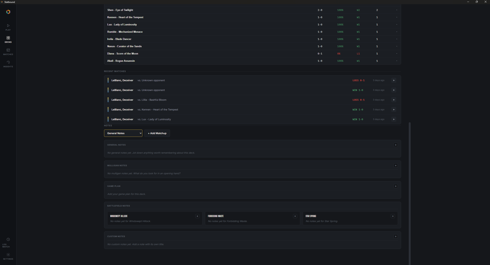
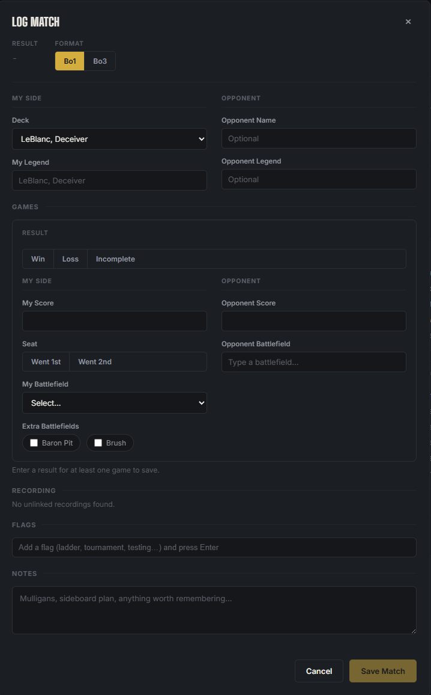
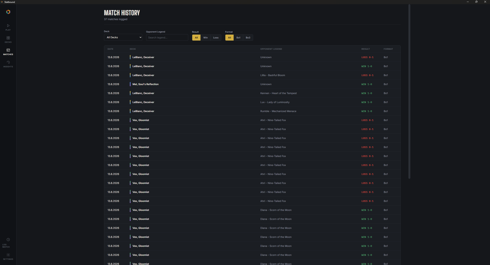
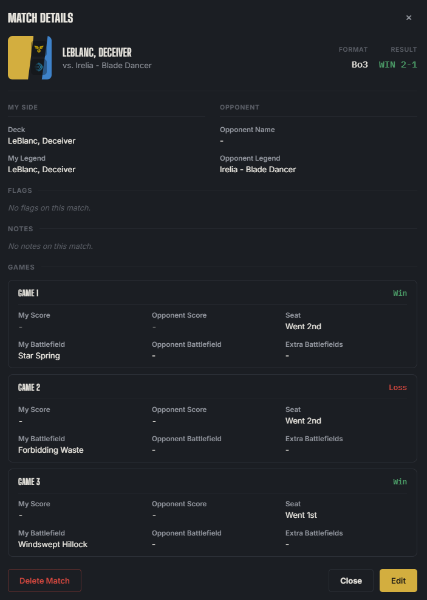
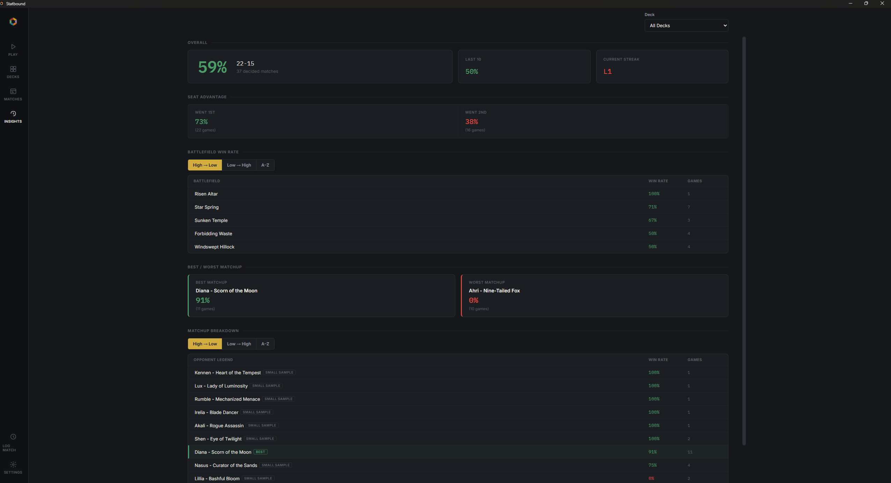
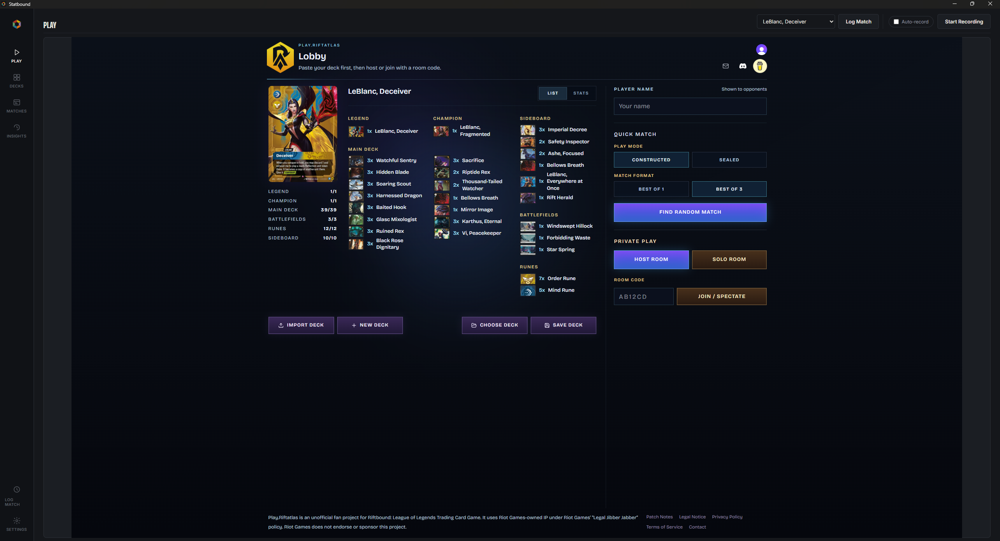

# Statbound

A local desktop companion app for the Riftbound TCG: deck tracking, match history, replay logging, and matchup prep for players.

## Features

### Deck Library and import

Build up a library of decks by pasting a text export directly into the app. The library view shows every saved deck alongside a stat strip (win rate, streak, best deck, last played).

### Deck Detail

Every deck has its own detail page: A stat summary, the full decklist, recent matches, matchup record, and notes, all in one place.

### Log Match

Log a match by hand: Bo1 or Bo3, your deck, your opponent's name and Legend, one or more games with results, seat, battlefields, and any extra board features, plus free-text tags and notes. Matches can be edited or deleted later from their detail view.

### Match History

A single running list of every match you've logged across every deck, filterable by deck, opponent Legend, result, and format.

### Insights

A stats dashboard across your whole match history, or narrowed to a single deck.

### Play tab

An embedded view of the Rift Atlas web client, right inside Statbound, so you can play without leaving the app.

### Replay recording

Record video of your games as you play them. You can start and stop recording manually, or turn on Auto-record so Statbound starts recording automatically when a game begins and stops automatically once you're back at the lobby. You can watch them from the Match Details screen.

## Your data stays on your machine

Statbound is local-only. The app makes no network calls on its own behalf; the only exception is the optional embedded Play tab, which loads the Rift Atlas web client, and only when you explicitly open that tab yourself. Your decks, match history, notes, and recordings are stored in a local database and local files on your own computer.

## Project status

Statbound is pre-1.0 and actively developed. There is no packaged installer available yet; packaged releases for Windows, macOS, and Linux are planned.

## Tech stack

- [Electron](https://www.electronjs.org/): desktop shell
- [React](https://react.dev/) + [Vite](https://vitejs.dev/) (via [electron-vite](https://electron-vite.org/)): UI
- [better-sqlite3](https://github.com/WiseLibs/better-sqlite3): embedded local database
- [ffmpeg](https://ffmpeg.org/) (via `ffmpeg-static`): replay video encoding

## License

Statbound is licensed under the [GNU General Public License v3.0](LICENSE) (GPLv3). In practical terms: you're free to use, modify, and distribute the app, including commercially, but any distributed modifications or forks must also be released as open source under GPLv3, this isn't a restriction on using the app itself, just on redistributing changed versions privately or proprietarily.
